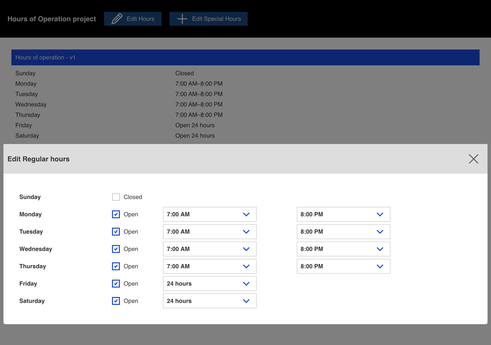
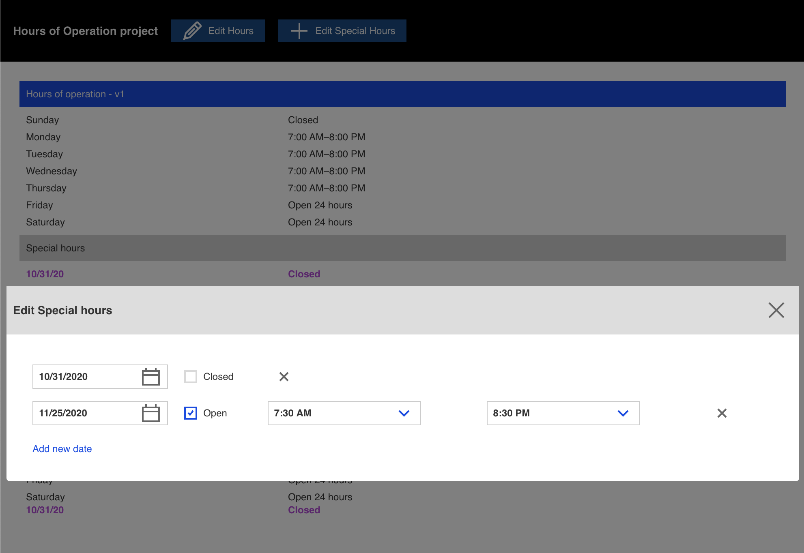
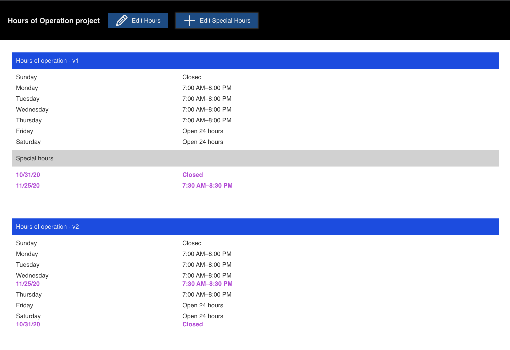
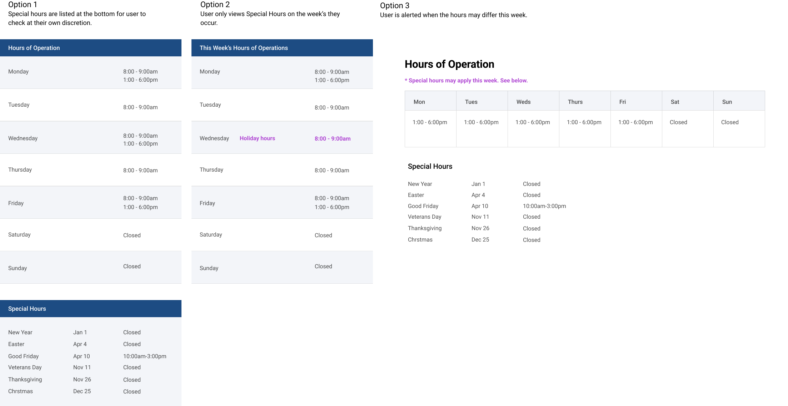

# Hours of Operation project

## Development

```
npm install
npm start
```

## Tech stack
- React
  - Context
  - Provider
  - Hooks
    - useReducer
    - useContext
    - useState
- `grommet` - component library
  - DateInput
  - Select
  - CheckBox
  - Box
  - Icons
- `date-fns` - date utility
- `uuid` - unique id utility
- `classnames` - className utility

## Design

### Edit
  - Modal for editing regular hours 
  - Modal for editing special hours 

### Views
  - v1 - show special hours in a separate table
  - v2 - show special hours in the same table




### UX Explorations
 - Option 1 - Special hours are listed at the bottom for user to check at their own discretion.
 - Option 2 - User only views Special Hours on the week’s they occur.
 - Option 3 - User is alerted when the hours may differ this week.



## User testing
- Tested for on mobile and desktop
- Tested for accessibility using keyboard and mouse
- Tested for color accessibility

## Data models
```json
regularHours = [
    {
        id: 0,
        name: 'Sunday',
        isOpen: true,
        open24Hrs: false,
        times: [
            {
                opensTime: 'time',
                closeTime: 'time',
            }
        ]
    }
]

specialHours = [
    {
        id: 0,
        date: new Date()
        isOpen: true,
        open24Hrs: false,
        times: [
            {
                opensTime: 'time',
                closeTime: 'time',
            }
        ]
    },
]
```

## MVP
- [x] Base app
- [x] Create a store
- [x] Add reducers
- [x] Edit hours
- [x] Show hours
- [x] Populate default hours
- [x] Add ability to add special hours
- [x] Show special hours separate from regular hours
- [x] Show special hours blended with regular hours
- [x] Mobile layout

## V2
- [ ] Add date sensitive taglines e.g. **closed today**, **closing soon**, **opening soon**
- [ ] Add calendar view
- [ ] Add a name field to Special hours
- [ ] Add ability to search in the time select box
- [ ] Allow adding multiple times per day or date
- [ ] Add prop-types validation
- [ ] Models in TypeScript
- [ ] Write unit tests
- [ ] Write component and snapshot tests
- [ ] Write E2E tests

## Author
Joe Seifi
